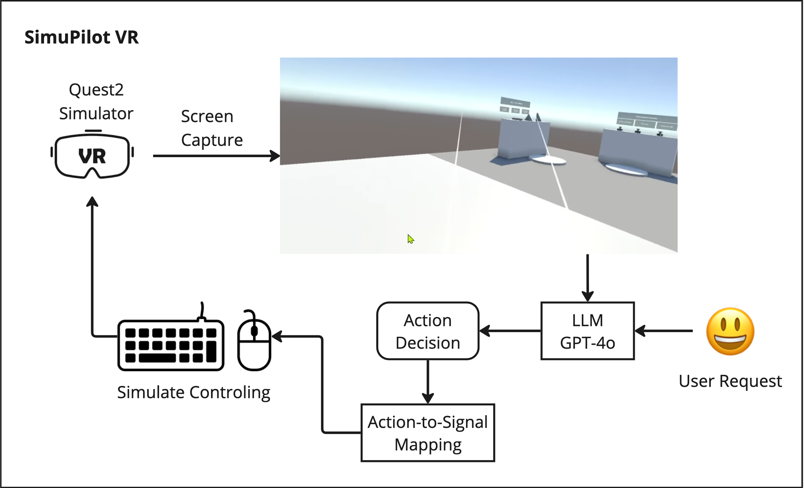

# SimuPilot VR

**SimuPilot VR** is a simulated, LLM-based pilot designed to help you operate seamlessly in Virtual Reality (VR) applications. It acts as an intelligent assistant, guiding users through complex interactions and offering real-time support within immersive environments.

---

## 🚀 Overview

SimuPilot VR integrates Large Language Models (LLMs) with your VR system to provide a natural, context-aware, and hands-free assistant. Whether you’re navigating virtual workspaces, controlling simulations, or exploring immersive content, SimuPilot VR acts as your intelligent co-pilot.

*Image: High-level system overview of SimuPilot VR*

---

## ✨ Highlight Features

- 🧠 **LLM-Powered Pilot**: Uses large language models to understand natural language commands and provide adaptive assistance.
- 🕶️ **VR-Optimized Interaction**: Tailored for intuitive voice and gesture control inside VR environments.
- 💪 **Pluggable Design**: Modular architecture that supports easy integration and customization for different VR applications.
- 📡 **Real-Time Support**: Offers contextual help and dynamic responses as users interact with the system.
- 🎮 **Multi-Platform Compatibility**: Works across a range of VR devices and engines (e.g., Unity, Unreal).
- 🧹 **Extensible Modules**: Add or extend capabilities via plug-and-play components.

---

Want to dive deeper? Check out the [Setup & Usage](setup.md) guide or explore [Supported Functions](support.md).

